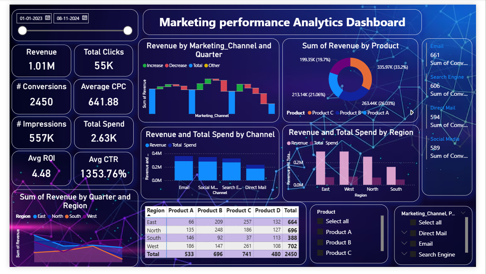

# customer-retention-and-churn-analysis-dashboard
Data-driven analysis of customer churn and retention with interactive Power BI visualizations.
## 📊 Customer Retention & Churn Analysis Dashboard

### 📌 Project Overview

This project focuses on analyzing customer retention and churn behavior using an interactive Power BI dashboard. The objective is to identify patterns, trends, and key factors that influence customer churn, enabling businesses to make data-driven decisions for improving customer retention and overall profitability.

The dashboard provides a comprehensive view of customer data, highlighting churn rate, customer segmentation, revenue distribution, and risk analysis. It is designed to help stakeholders quickly understand business performance and take proactive actions.

---

### 🎯 Objectives

* To measure overall customer churn rate and retention performance
* To identify high-risk customers likely to churn
* To analyze the impact of contract types on churn behavior
* To evaluate how services like online security and backup affect retention
* To compare revenue contribution between retained and churned customers

---

### 📈 Key Insights

* Customers with **month-to-month contracts** show significantly higher churn compared to long-term contracts
* Users without **online security and backup services** are more likely to churn
* **New customers** contribute less revenue compared to existing customers
* Higher churn rate is observed in customers with **short tenure (0–6 months)**
* A noticeable segment of customers falls under the **high-risk category**, requiring immediate attention

---

### 📊 Dashboard Features

* KPI cards showing **Total Customers, Churn Rate %, and Churned Customers**
* Bar charts for analyzing **churn by contract type**
* Visual breakdown of **monthly charges by services**
* Tenure-based churn analysis
* Customer segmentation into **risk categories (Normal vs High Risk)**
* Revenue comparison between **new and existing customers**

---

### 🛠️ Tools & Technologies Used

* Power BI (Data Visualization & Dashboard Creation)
* Microsoft Excel (Dataset & Data Cleaning)

---

### 📁 Dataset Information

The dataset includes customer-related attributes such as:

* Customer ID
* Contract Type
* Monthly Charges
* Tenure
* Services (Online Security, Backup, etc.)
* Churn Status

---

### 🚀 Conclusion

This dashboard helps in identifying the root causes of customer churn and provides actionable insights to improve retention strategies. Businesses can use these insights to focus on high-risk customers, optimize service offerings, and enhance customer satisfaction.

---

### 📸 Dashboard Preview

